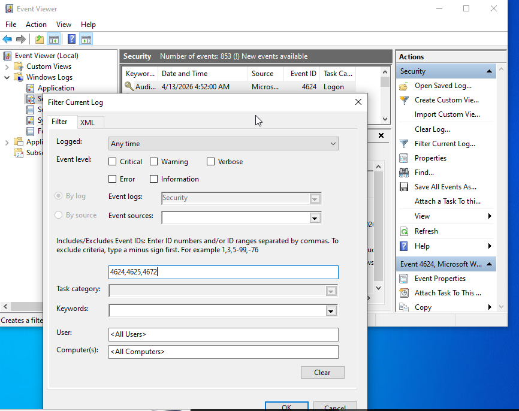

# 🔵 Log Analysis & Threat Hunting (Windows Event Viewer)

## 📌 Objective
The aim of this lab is to analyse Windows Event Logs to identify suspicious activity such as failed logins, privilege escalation, and potential brute force attacks.

---

## 🧰 Tools Used
- Windows Event Viewer

---

## 🔍 Steps Taken

### 1. Access Security Logs
Opened Event Viewer and navigated to: Windows Logs → Security

---

### 2. Filter Relevant Event IDs
Filtered logs to focus on key security events:4624, 4625, 4672

---

### 3. Analyse Login Activity
Reviewed logs to identify:
- Multiple failed login attempts (Event ID 4625)
- Successful logins (Event ID 4624)
- Admin privilege assignments (Event ID 4672)

---

### 4. Identify Suspicious Behaviour
Looked for patterns such as:
- Repeated failed logins followed by a success
- Logins at unusual times
- Standard users receiving admin privileges

---

## 🚨 Findings

Example observations:
- Multiple failed login attempts followed by a successful login → Possible brute force attack
- Admin privileges assigned after login → Potential privilege escalation

---

## 🧠 Key Takeaways

- Event logs provide visibility into past system activity  
- Threat hunting focuses on identifying abnormal behaviour  
- Patterns in logs are key indicators of attacks  
- Event IDs are critical for identifying specific actions  

---

## 📷 Evidence

